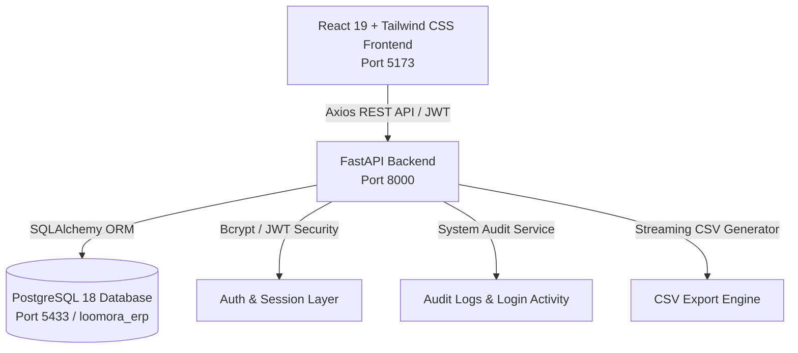

# LOOMORA ERP — Handloom & Textile Enterprise Platform

> **LOOMORA ERP** is a full-stack, enterprise-grade **Handloom & Textile Management Platform** designed for Indian handloom manufacturing houses, master weaver clusters, and textile exporters. Built with high craftsmanship to avoid generic SaaS dashboard aesthetics, Loomora features a rich Indian textile color identity (Deep Indigo, Royal Purple, Rich Teal, Saffron Amber, and Warm Linen), connected to a high-performance **Python FastAPI** backend and a dedicated **PostgreSQL** relational database.

---

## 🏛️ Architecture Overview



### Technology Stack
* **Frontend**: React 19, Vite, Tailwind CSS (Tailwind v4 with customized textile theme), Lucide Icons, Recharts, React Router v7.
* **Backend**: Python 3.12+, FastAPI, Uvicorn, SQLAlchemy ORM, Pydantic v2 validation, Passlib & Bcrypt, Python-JOSE (JWT tokens).
* **Database**: PostgreSQL 18 with relational foreign keys, cascade safety, and automated schema migrations.
* **Security**: HTTP Bearer JWT authentication, salted bcrypt password hashing, role-based permission access control (RBAC), and immutable audit logs.

---

## 🎨 Textile Design Palette

Loomora avoids the generic blue SaaS look in favor of an authentic Indian handloom aesthetic:
* **Deep Indigo (`#1E2447`)**: Primary navigation, headers, and brand anchors.
* **Royal Purple (`#381F68`)**: Core brand accent, active states, and focus rings.
* **Rich Teal (`#0D7C85`) & Turquoise (`#14B8A6`)**: Quality badges, natural dye indicators, and highlights.
* **Warm Saffron / Amber (`#D97706`)**: Artisan mastery badges, metrics, and loom machinery status.
* **Warm Linen Canvas (`#FAF8F5`)**: Background ivory surfaces with subtle textile weave micro-patterns.

---

## 🔑 Demo Access Credentials

| Role | Email | Password | Permissions |
| :--- | :--- | :--- | :--- |
| **Super Administrator** | `admin@loomora.com` | `Admin@123` | Full system access across all modules |
| **Production Manager** | `production@loomora.com` | `Prod@123` | Weaving floor, loom scheduling, artisans |
| **Master Weaver** | `weaver@loomora.com` | `Weaver@123` | Assigned loom production & craft specs |
| **Inventory Manager** | `inventory@loomora.com` | `Stock@123` | Yarn godowns, fabrics, reorder tracking |
| **Quality Inspector** | `quality@loomora.com` | `Quality@123` | Silk Mark audits, defect reports, grades |

*Note: The Login screen includes one-click "Demo Credentials" buttons to immediately populate test accounts.*

---

## 🚀 Quick Start Guide

### Prerequisites
* **Python 3.10+**
* **Node.js 18+** & **npm**
* **PostgreSQL 18** (or compatible PostgreSQL instance)

---

### Step 1: Database Setup
1. Ensure your PostgreSQL cluster is active.
2. In `backend/.env`, set your connection URL:
   ```env
   DATABASE_URL=postgresql://postgres@localhost:5433/loomora_erp
   SECRET_KEY=loomora_super_secret_handloom_textile_erp_key_2026_production
   ACCESS_TOKEN_EXPIRE_MINUTES=1440
   ```
3. Initialize the schema and seed enterprise textile records:
   ```bash
   cd backend
   python scripts/init_db.py
   python scripts/seed_data.py
   ```
   *Seeds 22 Users, 10 Roles, 11 Departments, 4 Plants, 18 Products, 16 Fabrics, 12 Yarns, 16 Colours, 12 Designs, 22 Artisans, 12 Looms, 11 Suppliers, 11 Customers, 6 Warehouses, 8 UOM, and 5 Tax Rates.*

---

### Step 2: Start Backend Server
```bash
cd backend
pip install -r requirements.txt
uvicorn app.main:app --host 127.0.0.1 --port 8000 --reload
```
* **Interactive API Documentation (Swagger)**: [http://127.0.0.1:8000/docs](http://127.0.0.1:8000/docs)
* **Alternative API Docs (ReDoc)**: [http://127.0.0.1:8000/redoc](http://127.0.0.1:8000/redoc)
* **Health Endpoint**: [http://127.0.0.1:8000/api/health](http://127.0.0.1:8000/api/health)

---

### Step 3: Start Frontend Client
```bash
cd frontend
npm install
npm run dev -- --host 127.0.0.1 --port 5173
```
* Access the web application at [http://127.0.0.1:5173](http://127.0.0.1:5173).

---

## 📦 System Modules & Feature Walkthrough

### 1. User Management
* **User Directory (`/users`)**: Search, filter by department/role/status, avatar previews, pagination, status toggling, reset password modal, and full user creation/editing.
* **User Detail View (`/users/:id`)**: Comprehensive profile tabs (Overview, Permissions, Activity Log, Login History).
* **Roles & Permissions Matrix (`/roles`)**: Visual grid of 10 system roles vs 17 enterprise modules with real-time toggle and persistent database updates.
* **Departments (`/departments`)**: Textile department registry (Weaving, Dyeing, Quality, Designing, Merchandising) with plant associations.
* **Plant / Manufacturing Units (`/plants`)**: Heritage manufacturing clusters (Kanchipuram, Varanasi, Pochampally, Surat).
* **User Approvals Workflow (`/user-approvals`)**: Interactive queue for pending employee access requests with decision reasoning.
* **Login Activity (`/login-activity`)**: IP tracking, user-agent details, login statuses, and session timestamps.
* **System Audit Logs (`/audit-logs`)**: Complete historical audit trail of CREATE, UPDATE, and DELETE actions.

### 2. Master Data Management (12 Real PostgreSQL CRUD Modules)
* **Master Data Hub (`/master-data`)**: Visual hub with 12 distinct cards, record counters, and quick creation shortcuts.
* **Product Master (`/products`)**: Saree & textile catalog, fabric linkages, design motif attachments, cost vs selling prices, and margin % calculations.
* **Fabric Master (`/fabrics`)**: Fabric weaves (Mulberry Silk, Tussar, Organic Cotton), GSM weights, widths, and yarn densities.
* **Yarn Master (`/yarns`)**: Deniers & Ne counts (20/22D, 2/120s Ne), raw fiber compositions, and stock level warnings.
* **Colour & Dye Master (`/colours`)**: Live hex swatches, synchronized `<input type="color">` pickers, and dye formulas (Natural Indigo, Madder Root, Azo-Free).
* **Designs & Motifs (`/designs`)**: Traditional artwork (Peacock, Paisley, Temple Gopuram), Jacquard punch card hooks, and collections.
* **Looms Master (`/looms`)**: Machinery registry (Pit looms, Frame looms, Jacquards), daily meter capacity, maintenance scheduling, and assigned weavers.
* **Artisans & Weavers (`/artisans`)**: Master weaver profiles, years of craft experience, craft specializations, and loom linkages.
* **Suppliers Master (`/suppliers`)**: Raw material vendors, GSTIN validation, and payment terms.
* **Customers Master (`/customers`)**: Wholesale textile clients, designer boutiques, credit limits, and addresses.
* **Warehouses Master (`/warehouses`)**: Godowns (Raw yarn, Finished goods, Dyes) with square footage capacities.
* **UOM Master (`/uom`)**: Meters, kilograms, pieces, yards, than, and square feet conversions.
* **Tax / GST Master (`/tax-rates`)**: Indian textile GST slabs (5%, 12%, 18%) with HSN codes (5007 Silk, 5208 Cotton).

### 3. Operations
* **Weaving Production (`/production`)**: Live loom batch yardage progress bars, artisan assignments, and schedule tracking.
* **Inventory Stocks (`/inventory`)**: Reorder level alerts, warehouse distribution, and stock health status.
* **Purchase Orders (`/purchase`)**: Raw material PO commitments, vendor stages, and expected delivery tracking.
* **Sales Orders (`/sales`)**: Wholesale bookings, client dispatches, and invoice tracking.
* **Quality Assurance (`/quality`)**: Fabric grading (Grade A Export, Grade B, Rejects), defect notes, and Silk Mark compliance.

### 4. Reports & Analytics
* **CSV Export Center (`/reports`)**: Live authenticated CSV downloads for Users, Products, Fabrics, Artisans, Looms, Suppliers, and Customers.

### 5. Global Search
* **`Ctrl + K` or Command Bar**: Real-time cross-entity search indexing Products, Fabrics, Yarns, Artisans, Looms, Suppliers, and Customers.

---

## 🛡️ Production Build & Verification

```bash
# Verify backend unit/integration tests & APIs
python scratch/test_e2e.py

# Verify frontend production build
cd frontend
npm run build
```

---

## 📜 License
Proprietary software developed for **Ragav Handloom / Loomora Solutions**. All rights reserved.
